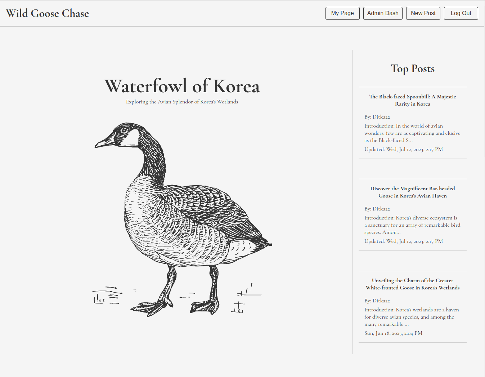
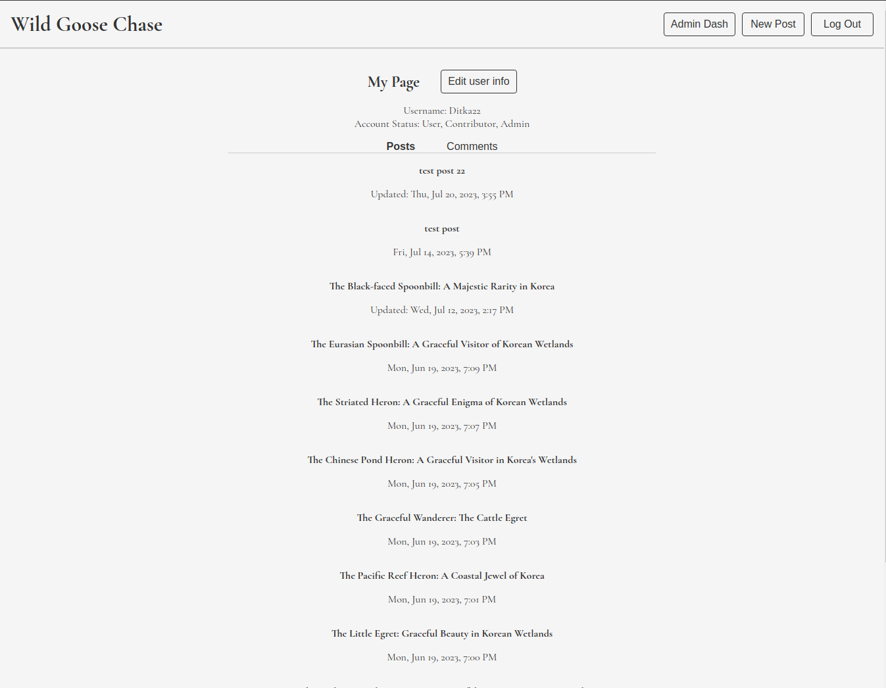
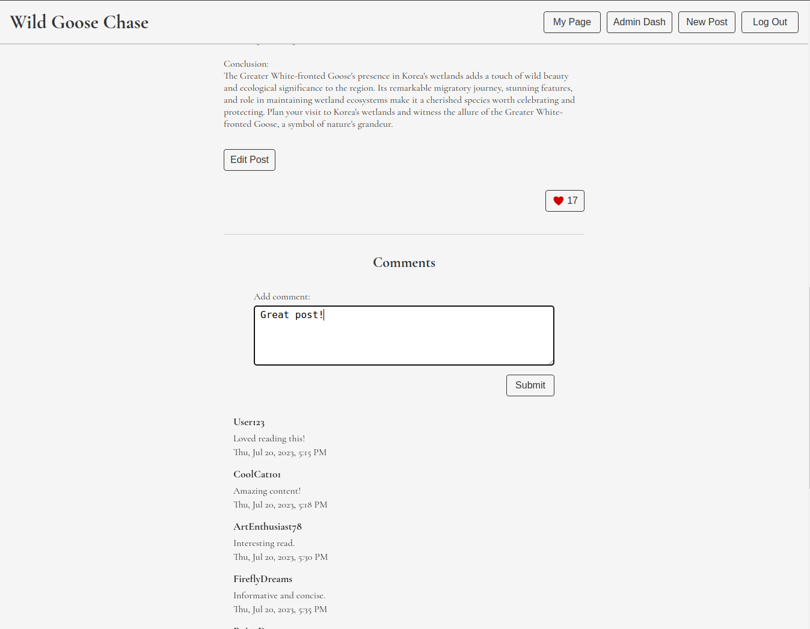
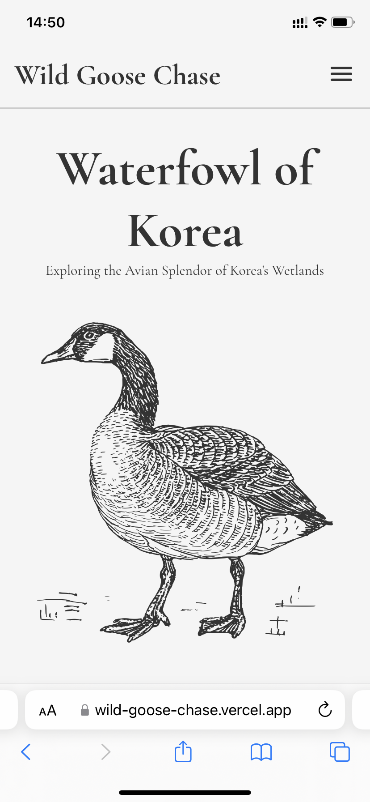
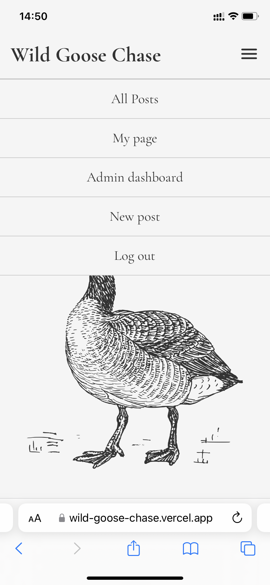

# 와일드 구스 체이스 블로그

이 리포지토리는 MERN 스택 블로그 애플리케이션인 와일드 구스 체이스의 프런트엔드 코드입니다.

이 프로젝트는 [The Odin Project](https://www.theodinproject.com/)의 NodeJS 과정을 따르며 개발한 것입니다.

## Demo

애플리캐이션은 [여기](https://wild-goose-chase.vercel.app/)에서 사용할 수 있습니다.

## 백엔드 코드

백엔드 코드는 이 [리포지토리](https://github.com/Stillwell-C/blog-api)를 참조해 주세요.

API 랜딩페이지는 [여기](https://wild-goose-chase-api-production.up.railway.app)에서 볼 수 있습니다.

## 차례

- [내용](#내용)
  - [요약](#요약)
  - [상세 내용](#상세-내용)
    - [UI](#ui)
    - [API & 인증](#api--인증)
    - [유저 및 작성자, 관리자](#사용자-및-작성자-관리자)
    - [웹 접근성](#웹-접근성)
    - [부가 내용](#부가-내용)
  - [알려진 문제](#알려져-있는-문제)
    - [인증](#인증)
- [기술 스택](#기술-스택)
- [스크린샷](#스크린샷)
  - [데스크탑](#데스크탑)
  - [모바일](#모바일)

## 내용

### 요약

- MERN 스택 / REST API
- 반응형 모바일 퍼스트 (mobile-first) UI
- RTK Query 데이터 요청과 프런트엔드 캐싱
- Redux Toolkit
- JWT Refresh & Access 토큰 인증
- 프런트엔드 보호된 경로 (protected frontend routes)
- 사용자 계정를 등록하고 삭제
- 사용자 아이디와 암호를 수정
- 3가지 사용자 등급: 유저, 작성자, 관리자
- 유자 - 댓글 남기고 사제하고 블로그 포스팅 좋아요 누르다
- 작성자 - 블로그 포스팅을 공유/수정/삭제
- 관리자 - 댓글과 블로그 포스팅, 사용자를 삭제
- A11y 웹 접근성
- Jest & supertest으로 백엔드 테스트
- Express Validator로 유저 데이터 입력 확인

#### 상세 내용

이 애플리케이션은 한국 물새에 대한 간단한 블로그 애플리케이션입니다.

#### UI

작은 모바일 화면부터 큰 컴퓨터 디스플레이까지 모두 잘 작동하도록 반응형 모바일 퍼스트 (mobile-first) 방식으로 UI를 설계했습니다. 모든 스타일링은 CSS로 구현하였습니다.

#### API & 인증

사용자가 등록한 후에 아이디와 암호로 로그인을 할 수 있습니다. [bcrypt](https://www.npmjs.com/package/bcrypt) 패키지를 사용해 데이터베이스에 저장된 암호는 등록 과정에서 암호화되며 인증 과정에서 복호화됩니다.

[express-rate-limit](https://www.npmjs.com/package/express-rate-limit) 패키지를 이용하여 사용자가 1분 안에 5번 로그인을 시도하면 로그인 시도가 1분 동안 중지됩니다.

인증은 HTTP only secure 쿠키 안에 있는 JWT refresh 토큰과 Redux store에 저장된 15분 유효 기간의 JWT access 토큰으로 확인됩니다. 보안 문제를 피하기 위해 토큰은 로컬 스토리지에 저장되지 않습니다.

로그인된 사용자가 페이지를 리프레시하여 Redux store가 초기화된 경우 등으로 access 토큰이 없는 상황이거나, 백엔드에 보낸 요청이 유효 기간이 지난 access 토큰으로 인해 거부되는 경우, 프런트엔드는 자동으로 사용자 refresh 토큰을 API의 refresh 토큰 엔드포인트로 보냅니다. 백엔드는 새로운 access 토큰을 발급하고 프런트엔드는 이를 저장한 후, 원래 요청을 재시도합니다. 이 과정이 여러 번 실패하면 사용자는 로그아웃됩니다.

"My Page" 프로필 대시보드 데이터 등 일부 API 엔드포인트를 요청하려면 유효한 JWT access 토큰이 필요합니다. JWT 인증은 [jsonwebtoken](https://www.npmjs.com/package/jsonwebtoken) 패키지를 통해 이루어집니다. 유효한 JWT가 필요한 API 엔드포인트에 해당하는 페이지는 보호된 경로(protected route)로 설정되어 있으며, 프런트엔드에서는 로그인된 사용자만 접근할 수 있습니다. 또한 프런트엔드에서는 사용자 등급에 따라 보호된 경로도 설정되어 있습니다. 예를 들어, 관리자 등급을 가진 로그인된 사용자만 관리자 대시보드에 접근할 수 있습니다.

프런트엔드에서는 [RTK Query](https://redux-toolkit.js.org/rtk-query/overview)와 Redux Toolkit을 사용하여 API 요청을 관리하고 데이터를 캐싱합니다.

백엔드에서 [cors](https://www.npmjs.com/package/cors) 패키지를 이용하여 특정 출처에서만 API에 접근할 수 있도록 설정되어 있습니다.

#### 유저 및 작성자, 관리자

사용자 계정은 유저, 작성자, 관리자 등 3가지 등급으로 나누어져 있으며, 각 등급은 특정 권한을 가지고 있습니다. 유저는 기본적인 사용자 등급으로, 새로 등록한 사용자 모두가 유저입니다.

유저는 관리자 대시보드와 블로그 포스팅 작성/수정 페이지를 제외하고 애플리케이션의 모든 페이지에 제한 없이 접속할 수 있습니다. 유저는 블로그 포스팅 페이지에 접속하여 좋아요를 누르고 댓글을 남길 권한이 있습니다. 또한, "My Page" 사용자 대시보드에서 남긴 댓글을 확인하고 삭제할 수 있습니다. 관리자는 계정에서 유저 등급을 제거할 수 없습니다.

작성자는 유저와 동일한 권한을 가지며, 블로그 포스팅을 새로 공유하고 자신이 작성한 블로그 포스팅을 수정하거나 삭제할 수 있습니다. "My Page" 사용자 대시보드로 이동하면 자신이 올린 포스팅을 볼 수 있습니다. 작성자는 로그인 후 내비게이션 메뉴에서 "New Post" 버튼을 클릭하면 포스팅 작성 페이지로 이동할 수 있습니다. 또한, 자신이 올린 포스팅을 볼 때, 포스팅 내용 아래에 있는 "Edit Post" 버튼을 통해 포스팅을 수정하거나 삭제할 수 있습니다.

관리자는 유저와 동일한 권한을 가지며, 관리자 대시보드와 블로그 포스팅 수정/삭제 페이지에 접근할 수 있습니다. 관리자는 블로그 포스팅을 새로 올릴 수는 없지만, 이미 올린 포스팅을 수정하거나 삭제할 수 있습니다. 관리자 대시보드에서는 모든 사용자와 포스팅, 댓글을 확인할 수 있습니다. 대시보드를 통해 관리자는 사용자 등급 수정 및 사용자 계정 삭제, 블로그 포스팅 수정/삭제, 댓글 삭제를 수행할 수 있습니다. 다만, 다른 관리자의 정보를 수정하거나 삭제하려면 특별한 암호를 입력해야만 가능합니다.

#### 웹 접근성

특히 입력 양식과 오류 메시지, 모달에 대해 이 애플리케이션은 스크린 리더 등 웹 접근성을 고려하여 개발하려고 노력했습니다. 물론 ARIA나 웹 접근성 모범 사례(best practices)를 잘못 사용한 적이 있을 수 있지만, 웹 접근성의 중요성을 인지하고 애플리케이션의 접근성을 향상시킬 수 있는 요소나 권장 사항이 있다면 연락 부탁드립니다.

스크린리더 호환을 위해 [focus-trap-react](https://www.npmjs.com/package/focus-trap-react) 패키지를 사용하여 모달이 열릴 때 포커스가 모달 내로만 제한됩니다. 모든 모달은 ESC 키를 사용하여 닫을 수 있습니다.

#### 부가 내용

애플리케이션을 사용하다가 로그인이나 등록 버튼을 누르면 현재 URL이 로그인/등록 컴포넌트에 props로 전달됩니다. 로그인/등록이 완료되면 해당 URL로 다시 리다이렉트됩니다.

텍스트 내용은 대부분 ChatGPT를 사용하여 생성하였습니다.

## 알려진 문제

### 인증

- 이 demo 애플리케이션의 호스팅 비용을 절약하기 위해 프런트엔드는 [Vercel](https://vercel.com/)에서, 백엔드는 [Railway](https://railway.app/)에서 호스팅합니다. 따라서 refresh 토큰을 저장하는 HTTP only, secure 쿠키가 cross-site 쿠키가 되어, 사파리 브라우저와 여러 브라우저의 시크릿 모드 등 특정 브라우저에서 지속적 로그인이 제대로 동작하지 않습니다. 사용 중인 브라우저가 cross-site 쿠키를 금지하면 지속적 로그인이 불가능하며 페이지를 리프레시하면 로그아웃됩니다.

- 애플리케이션은 로컬에서 실행하면 상기 문제가 발생하지 않습니다.

## 기술스택

### 프런트엔드

- ReactJS
- React Router
- RTK Query / Redux Toolkit
- CSS

### 백엔드

- NodeJS
- ExpressJS
- MongoDB/Mongoose
- Bcrypt
- Express Validator

## 스크린샷

### 데스크탑

#### Homepage

#### User Page

#### Admin Dashboard

#### Paginated Posts

#### Like & Comment on Posts

### 모바일

#### Homepage

#### Mobile Dropdown Menu

#### Mobile Posts

