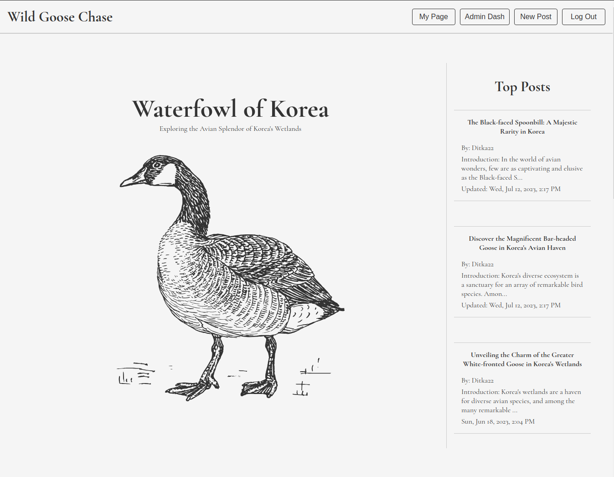
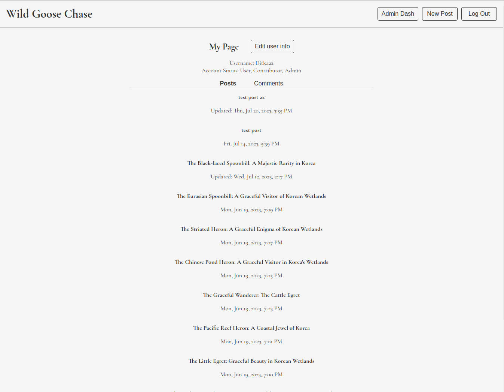
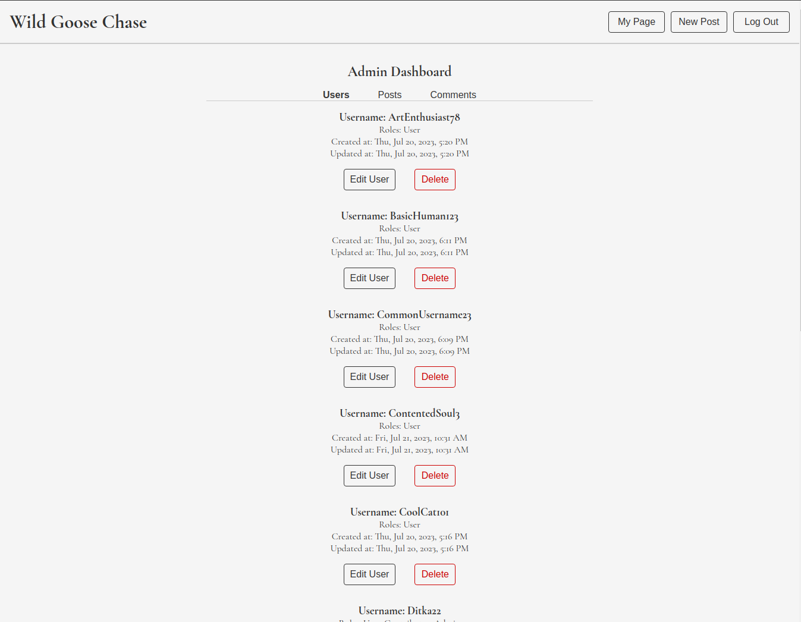
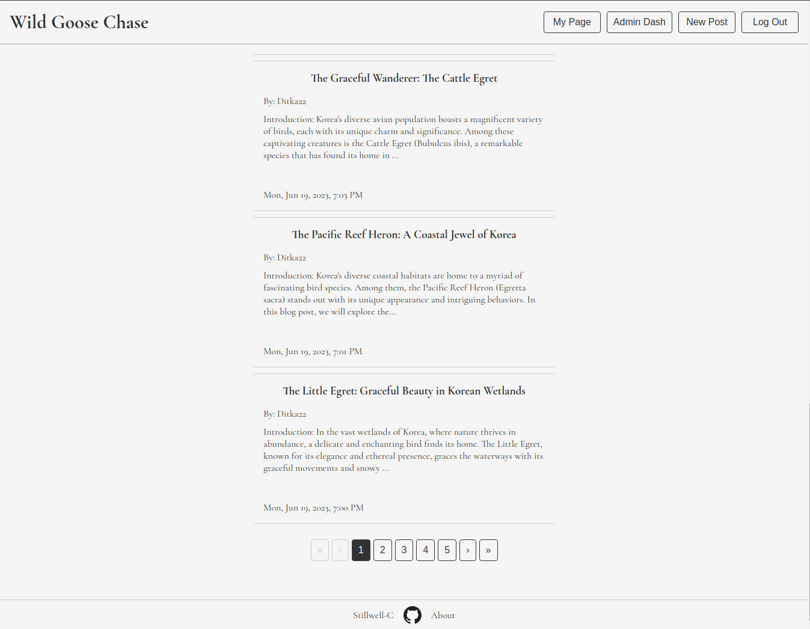
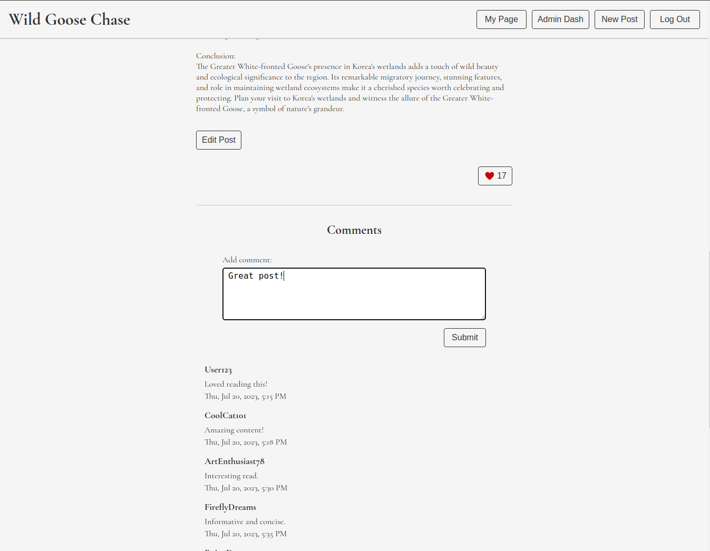
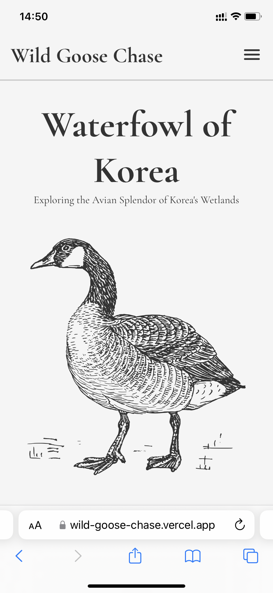
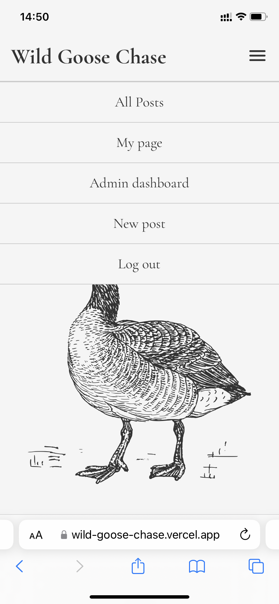
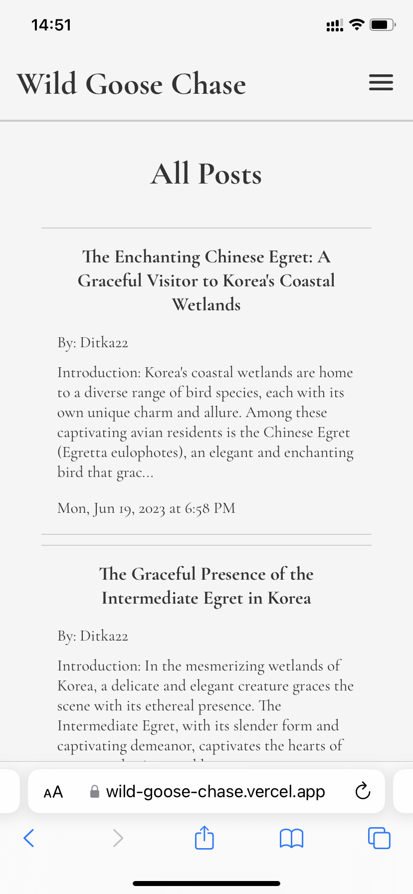

# Wild Goose Chase Blog

This repository is the frontend for Wild Goose Chase, a MERN stack blog application.

I made this while following the NodeJS course from [The Odin Project's](https://www.theodinproject.com/) curriculum.

## Demo

The application is live at https://wild-goose-chase.vercel.app/

## Backend code

View the backend code [here](https://github.com/Stillwell-C/blog-api)

Or the API's landing page [here](https://wild-goose-chase-api-production.up.railway.app)

## Contents

- [Description](#description)
  - [Overview](#overview)
  - [Detailed Description](#detailed-description)
    - [UI](#ui)
    - [API & Authentication](#api--authentication)
    - [Users, Contributors, and Admins](#users-contributors-and-admins)
    - [Accessibility](#accessibility)
    - [Additional Info](#additional-info)
  - [Known Issues](#known-issues)
    - [Authentication & Persisted Log In On Certain Browsers](#authentication--persisted-log-in-on-certain-browsers)
- [Built With](#built-with)
- [Screenshots](#screenshots)
  - [Desktop](#desktop)
  - [Mobile](#mobile)

## Description

### Overview

- Built using MERN stack / REST API
- Reponsive, mobile-first UI
- RTK Query for querying/caching data
- Authentication with JWT refresh & access tokens
- Protected frontend routes
- Create/delete user accounts
- Edit username and password
- Separate user roles: user, contributor, admin
- Create/delete comments and like posts as a user
- Create/edit/delete posts as a contributor
- Delete comments, posts, users as an admin
- A11y accessibility (to the best of my ability)
- Backend tested jest & supertest
- User input data validated with Express Validator

#### Detailed Description

This application was made to function as a simple blog.

#### UI

The UI was made to be responsive with a mobile-first design and should function on both mobile devices and web browsers with larger screens. CSS was used to style most components.

#### API & Authentication

Users can create an account and sign in using their username and a password. Passwords are encrypted/decrypted and verified using the [bcrypt](https://www.npmjs.com/package/bcrypt) package.

Users are limited to 5 attempts at signing in within a minute before being restricted from signing out for one minute using the [express-rate-limit](https://www.npmjs.com/package/express-rate-limit) package.

Authentication is handled with a JWT refresh token stored in an HTTP only secure cookie and a separate JWT access token stored in a redux store with a 15-minute expiration.

If a user is logged in and does not have a JWT access token (e.g. the user has refreshed their page) or has sent a request to the sever that has been rejected due to an expired access token, the front end will automatically access the API's refresh route and save the access token received before reattempting the user's initial request.

Specific routes such as the "My Page" dashboard require a valid JWT access token to access. JWT verification is done using the [jsonwebtoken](https://www.npmjs.com/package/jsonwebtoken) package. Routes requiring JWT are protected on the front end to ensure that a user is logged in or has the necessary roles to view a page (e.g. a logged in account with the role user will not be able to visit the admin dashboard by using the admin dashboard URL).

[RTK Query](https://redux-toolkit.js.org/rtk-query/overview) and Redux Toolkit are used to make server requests and cache/invalidate data on the front end.

The [cors](https://www.npmjs.com/package/cors) package is used to only allow requests from specific origins. In this case, I am only allowing requests originating from the frontend.

#### Users, Contributors, and Admins

Accounts on this website can be one or more of the 3 different roles - user, contributor, and admin - all with different priveleges. The default role is user, and all new accounts will only have the user role.

Users have access to all pages on the website except for the admin dashboard and create/edit post pages. Users are able to view all posts on the website, like posts, and comment on posts. Additionally they can view and delete comments they have made on the My Page dashboard. This is the base role for all users, and Admins cannot remove this role from profiles.

Contributors have access to all pages that users can access as well as the create new post and edit post pages. Contributors have the same priveleges as users but will also be able to create/edit/delete their own posts. A user's posts can be viewed through the "Posts" tab of the My Page dashboard. Contributors have an additional "New Post" button on their navigation menu. Additionally, when viewing a post where they are the author, an "Edit Post" button will appear at the bottom that allows them to edit or delete the post.

Admins have access to all pages that users can access as well as the Admin Dashboard page and the edit/delete post page. An admin cannot create a new post but can delete or edit existing posts. The Admin Dashboard allows admins to see all users, posts, and comments. Here they are able to edit account roles or delete accounts (editing another admin's profile requires password verification), edit/delete posts, and delete comments.

#### Accessibility

Throughout this project, I have tried to make this website accessible to screen readers, especially with respect to forms, navigation menus & pagination buttons, error messages, and modals. However, any input on how to improve on this is greatly appreciated. I am sure there are instances where I have misused or neglected to properly implement ARIA or other accessibility best practices.

The [focus-trap-react](https://www.npmjs.com/package/focus-trap-react) package is used to trap focus when a modal is present on the screen. All modals can be exited using the escape key.

#### Additional Info

All links/buttons leading to the log in and sign up pages will send the address of the page the user is currently on to the log in/sign up component. Upon successfully logging in, a user will be redirected back to their original page.

Almost all text content was generated using ChatGPT.

## Known Issues

### Authentication

- The frontend is hosted on [Vercel](https://vercel.com/) and the backend is hosted on [Railway](https://railway.app/). Resultingly, the refresh token stored in an HTTP only secure cookie is a cross-site cookie and does not function properly on some browsers, including Safari and incognito or private browser modes of browsers such as Chrome and Opera. Due to how these browsers treat the cross-site cookie, log cannot be persisted and refreshing the page will log you out.

## Built with

### Frontend

- ReactJS
- React Router
- RTK Query / Redux Toolkit
- CSS

### Backend

- NodeJS
- ExpressJS
- MongoDB/Mongoose
- Bcrypt
- Express Validator

## Screenshots

### Desktop

#### Homepage

#### User Page

#### Admin Dashboard

#### Paginated Posts

#### Like & Comment on Posts

### Mobile

#### Homepage

#### Mobile Dropdown Menu

#### Mobile Posts

